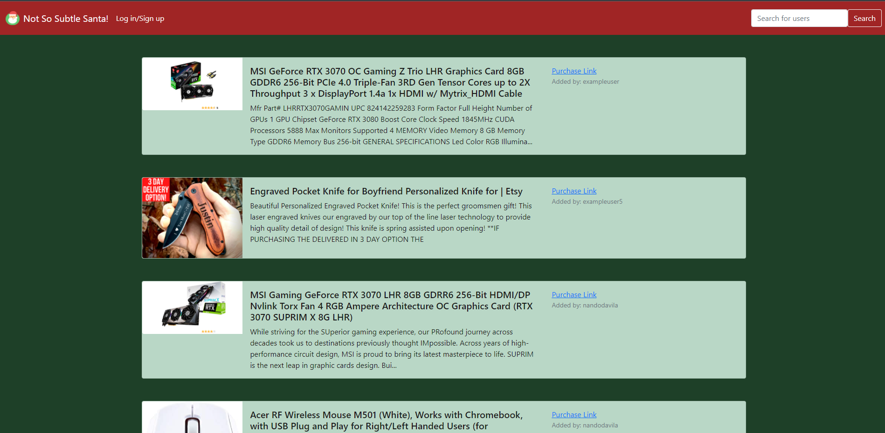
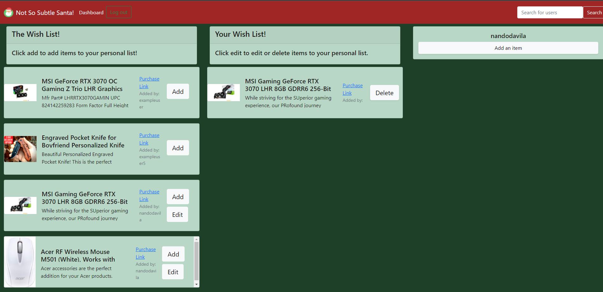

# **Not So Subtle Santa**

   

  ### Table of Contents
  **[Description](#description)**<br>
  **[Usage](#usage)**<br>
  **[License](#license)**<br>
  **[Contributing](#contributing)**<br>
  **[Tests](#tests)**<br>
  **[Questions](#Questions)**<br>
  

  ## Description 
  
  This is an app, to help with gift giving, and sharing gift ideas. You can easily share your Wish List with other users, authenticated or not. The main Wish List brings a sense of community to the site. You can see all the other items other users have added. It can provide inspiration for your own list, or for a family/friends gift. You can easily add links, images, and descriptions to you item. 
 

  ## Installation
  npm i

  ## Usage

   ```md 
  As a consumer that loves getting gifts, 
  I want to have a way to easily share my wish list with my friends and family, 
  So that they know what to get for me or themselves
  ```

  ## Contributing

  Garrett Bryan, Nando Davila, Sean O'Very, Cornelia Herman

   
  ## Questions
  ### Nando Davila:
    Github: nandodavila
    email: nandodavila94@gmail.com
  ### Cornelia Herman
    Github: cormillionaire
    Email: corneliabherman@gmail.com
 
  ### Garrett Bryan
    Github: GarrettLB
    Email: garrettleebryan@gmail.com

  ### Sean O'Very 
    Github: SeanOVery
    Email: seanovery1@gmail.com
   

  ## Link 
  https://wish-list-fscg.herokuapp.com/

  ## Example
  
  

  
